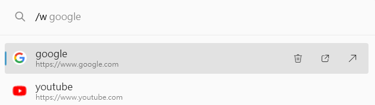
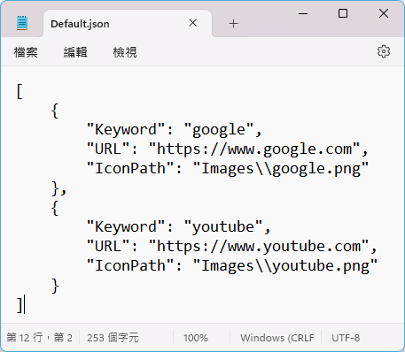
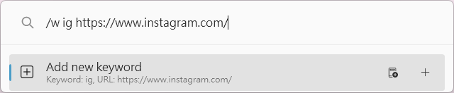

# PowerToys Run Plugin: FastWeb

A [PowerToys Run](https://learn.microsoft.com/zh-tw/windows/powertoys/run) plugin to open website in browser.

## Features
### Open link in browser


### Set your own favorite website in config file


### Add new keyword by command



## Installation
1. Download the latest release of the from the [releases page](https://github.com/CCcat8059/FastWeb/releases).
2. Extract the `.zip` file's contents to `%LocalAppData%\Microsoft\PowerToys\PowerToys Run\Plugins`
3. Restart PowerToys.

## Usage
1. Open PowerToys Run (default shortcut is `Alt+Space`).
2. Type `/w` and search for website name that you set in file.

## How To Build
1. Make sure you have [gsudo](https://github.com/gerardog/gsudo) installed in the path.
2. Copy `.dll` from the PowerToys Run folder to `.\Lib`  
 (using symlink or running `Devtools\copyLib.ps1` is recommended).
    - `PowerToys.Settings.UI.Lib.dll`
    - `PowerToys.ManagedCommon.dll`
    - `PowerToys.Common.UI.dll`
    - `Wox.Plugin.dll`
    - `Wox.Infrastructure.dll` 
3. Right-click on `Properties\Resources.resx` and select `Run Custom Tool`  
 (`Resources.Designer.cs` changes completely for unknown reasons).
4. Build the project.
5. Run `Devtools\debug.ps1`.

```
If you find any bug in this plugin, 
you're welcome to report it to me :)
```
